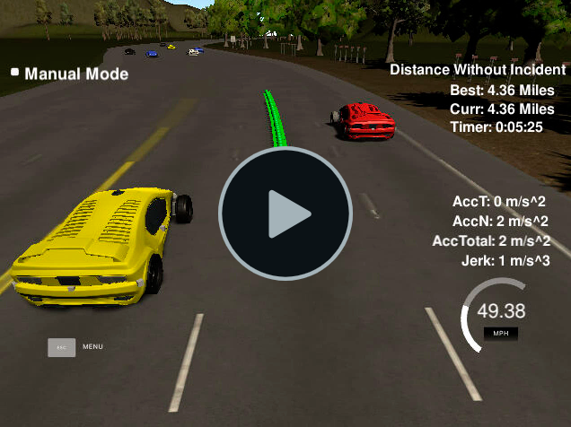

# CarND-HighwayDriving-P7
Udacity Self-Driving Car Engineer Nanodegree Program <br>
[](http://www.udacity.com/drive)

<p align="center">

</p>

# Overview

The goal this project is to safely navigate around a virtual highway with other traffic that is driving +-10 MPH of the 50 MPH speed limit. The path planner gets the localization of the car and sensor fusion data from a simulator. A map is available that lists the waypoints around the highway. The car should try to go as close as possible to the 50 MPH speed limit, which means passing slower traffic when possible, note that other cars will try to change lanes too. The car should avoid hitting other cars at all cost as well as driving inside of the marked road lanes at all times, unless going from one lane to another. The car should be able to make one complete loop around the 6946m highway. Since the car is trying to go 50 MPH, it should take a little over 5 minutes to complete 1 loop. Also the car should not experience total acceleration over 10 m/s^2 and jerk that is greater than 10 m/s^3. The simulator sends car telemetry information (car's position and velocity) and sensor fusion information about the rest of the cars in the highway (Ex. car id, velocity, position). It expects a set of points spaced in time at 0.02 seconds representing the car's trajectory. The communication between the simulator and the path planner is done using [WebSocket](https://en.wikipedia.org/wiki/WebSocket). The path planner uses the [uWebSockets](https://github.com/uNetworking/uWebSockets) WebSocket implementation to handle this communication.

My code for this project is publicly available and can be found here: <br>https://github.com/ednaldogoncalves/CarND-HighwayDriving-P7

## Steps

- You can use the project version on repository [here](https://github.com/udacity/CarND-Path-Planning-Project).

- If you decide to work in your local setup, you can download the latest simulator [here](https://github.com/udacity/self-driving-car-sim/releases/tag/T3_v1.2). To run the simulator on Mac/Linux, first make the binary file executable with the following command:
```shell
sudo chmod u+x {simulator_file_name}
```
- The code should stand on its own as redable material. Explain in code comments, as well as in your write-up, how your code works and why you wrote it that way.

- Make it easy for a reviewer to understand your code.

- The map of the highway is in data/highway_map.txt
Each waypoint in the list contains  [x,y,s,dx,dy] values. x and y are the waypoint's map coordinate position, the s value is the distance along the road to get to that waypoint in meters, the dx and dy values define the unit normal vector pointing outward of the highway loop. The highway's waypoints loop around so the frenet s value, distance along the road, goes from 0 to 6945.554.

## Basic Build Instructions

1. Clone this repo.
2. Make a build directory: `mkdir build && cd build`
3. Compile: `cmake .. && make`
4. Run it: `./path_planning`.

Here is the data provided from the Simulator to the C++ Program

#### Main car's localization Data (No Noise)

["x"] The car's x position in map coordinates
["y"] The car's y position in map coordinates
["s"] The car's s position in frenet coordinates
["d"] The car's d position in frenet coordinates
["yaw"] The car's yaw angle in the map
["speed"] The car's speed in MPH

#### Previous path data given to the Planner

//Note: Return the previous list but with processed points removed, can be a nice tool to show how far along
the path has processed since last time. 

["previous_path_x"] The previous list of x points previously given to the simulator
["previous_path_y"] The previous list of y points previously given to the simulator

#### Previous path's end s and d values 

["end_path_s"] The previous list's last point's frenet s value
["end_path_d"] The previous list's last point's frenet d value

#### Sensor Fusion Data, a list of all other car's attributes on the same side of the road. (No Noise)

["sensor_fusion"] A 2d vector of cars and then that car's [car's unique ID, car's x position in map coordinates, car's y position in map coordinates, car's x velocity in m/s, car's y velocity in m/s, car's s position in frenet coordinates, car's d position in frenet coordinates. 

## Details

1. The car uses a perfect controller and will visit every (x,y) point it recieves in the list every .02 seconds. The units for the (x,y) points are in meters and the spacing of the points determines the speed of the car. The vector going from a point to the next point in the list dictates the angle of the car. Acceleration both in the tangential and normal directions is measured along with the jerk, the rate of change of total Acceleration. The (x,y) point paths that the planner recieves should not have a total acceleration that goes over 10 m/s^2, also the jerk should not go over 50 m/s^3. (NOTE: As this is BETA, these requirements might change. Also currently jerk is over a .02 second interval, it would probably be better to average total acceleration over 1 second and measure jerk from that.

2. There will be some latency between the simulator running and the path planner returning a path, with optimized code usually its not very long maybe just 1-3 time steps. During this delay the simulator will continue using points that it was last given, because of this its a good idea to store the last points you have used so you can have a smooth transition. previous_path_x, and previous_path_y can be helpful for this transition since they show the last points given to the simulator controller with the processed points already removed. You would either return a path that extends this previous path or make sure to create a new path that has a smooth transition with this last path.

## Tips

A really helpful resource for doing this project and creating smooth trajectories was using http://kluge.in-chemnitz.de/opensource/spline/, the spline function is in a single hearder file is really easy to use.

---

## Dependencies

* cmake >= 3.5
  * All OSes: [click here for installation instructions](https://cmake.org/install/)
* make >= 4.1
  * Linux: make is installed by default on most Linux distros
  * Mac: [install Xcode command line tools to get make](https://developer.apple.com/xcode/features/)
  * Windows: [Click here for installation instructions](http://gnuwin32.sourceforge.net/packages/make.htm)
* gcc/g++ >= 5.4
  * Linux: gcc / g++ is installed by default on most Linux distros
  * Mac: same deal as make - [install Xcode command line tools]((https://developer.apple.com/xcode/features/)
  * Windows: recommend using [MinGW](http://www.mingw.org/)
* [uWebSockets](https://github.com/uWebSockets/uWebSockets)
  * Run either `install-mac.sh` or `install-ubuntu.sh`.
  * If you install from source, checkout to commit `e94b6e1`, i.e.
    ```
    git clone https://github.com/uWebSockets/uWebSockets 
    cd uWebSockets
    git checkout e94b6e1
    ```
---

## Files

My project consists of the following files:

- **README.md** (writeup report) documentation of the results.
- **main.cpp** The main c++ file that implements the communication with the simulator. The actual implementation of the path planner and the generation of the trajestories.
- **utility.cpp** Util functions.
- **videos** - videos recording of your vehicle driving autonomously overtaking other vehicle.

## Description

#### Compiling and executing the project

To build the project using the `make` command after creating the **build** folder, as per previous instructions above. This is an example of the output of this script:

```shell
root@870f75ddcc95:/home/workspace/carnd-path-planning-project/build# make
[100%] built target path_planning
```

The project could be executed directly using `./path_planning`

```shell
root@870f75ddcc95:/home/workspace/CarND-Path-Planning-Project/build# ./path_planning
Listening to port 4567
```

Now the path planner is running and listening on port 4567 for messages from the simulator. Next step is to open Udacity's simulator:

<p align="center">

</p>

## Project [Rubric](https://review.udacity.com/#!/rubrics/1971/view)

### Compilation
---

#### - The code compiles correctly.

No changes were made in the cmake configuration. A new file was added [src/spline.h](./scr/spline.h). It is the [Cubic Spline interpolation implementation](http://kluge.in-chemnitz.de/opensource/spline/): a single .h file you can use splines instead of polynomials. It was a great suggestion from the classroom QA video. It works great.

---
### Valid trajectories
---

#### - The car is able to drive at least 4.32 miles without incident.
I ran the simulator for around 5 miles without incidents:

<p align="center">

</p>

#### - The car drives according to the speed limit.
No speed limit red message was seen.

#### - Max Acceleration and Jerk are not Exceeded.
Max jerk red message was not seen.

#### - Car does not have collisions.
No collisions.

#### - The car stays in its lane, except for the time between changing lanes.
The car stays in its lane most of the time but when it changes lane because of traffic or to return to the center lane.

<p align="center">
The vehicle prefers to stay in the center lane, if it is in another lane, then if possible it goes back to the center.<br>
<br>
<a href="./src/Videos/back_center.mp4">Download video</a>
</p>

#### - The car is able to change lanes
The car change lanes when the there is a slow car in front of it, and it is safe to change lanes (no other cars around) or when it is safe to return the center lane.

<p align="center">
Overtaking another vehicle on the right lane<br>
<br>
<a href="./src/Videos/right_overtake.mp4">Download video</a>
<p>
<p align="center">
Overtaking another vehicle on the left lane<br>
<br>
<a href="./src/Videos/left_overtake.mp4">Download video</a>
<p>
<p align="center">
Overtaking another vehicle on the center lane<br>
<br>
<a href="./src/Videos/center_overtake.mp4">Download video</a>
<p>
<p align="center">
Overtaking changing two tracks at once<br>
<br>
<a href="./src/Videos/two_overtake.mp4">Download video</a>
</p>

---

### Reflection

Based on the provided code from classroom, the path planning algorithms start at [src/main.cpp](./src/main.cpp#L176) line 176 to the line 403. The code could be separated into different functions to show the overall process, actually, I tried to separate it into more function files, but it was showing a lot of compilation error, so I created just one more useful function file called [utility.cpp](./src/utility.cpp) where I put some auxiliary functions to perform the transformation of the coordinates. For this moment I believe that it reached the project's objective, but in the future I will be able to improve and better structure the code.

The Path Planning module is typically decomposed into the following set of sub-modules:

- **Prediction**: will predict the trajectories of the surrounding detected objects
- **Behavior**: will define a set of candidate high level targets for the vehicle to follow (lane changes, slow down …)
- **Trajectory**: for every possible high level targets, a precise path to follow will be computed. For each trajectory a cost will be derived (depending on feasibility, safety, legality, comfort and efficiency) and the trajectory with the lowest cost will be chosen.

<p align="center">

</p>

#### Coordinate transforms

Before going into the file details **main.cpp**, we discuss process models, we should mention **"Frenet Coordinates"**, which are a way of representing position on a road in a more intuitive way than traditional (x,y) Cartesian Coordinates.
With Frenet coordinates, we use the variables **s** and **d** to describe a vehicle's position on the road. The **s** coordinate represents distance *along* the road (also known as **longitudinal displacement**) and the *d* coordinate represents side-to-side position on the road (also known as **lateral displacement**).

<p align="center">

</p>

In the code, the provided Eigen-3.3 library, they are represented by the functions: **getFrenet** responsável por transform from Cartesian **x**,**y** coordinates to Frenet **s**,**d** coordinates, and the function **getXY** responsible to inverter from Frenet to Cartesian, but It's not a linear transformation. That something that's calculated at the very beginning that we can just feed it. And, that's used for the map inside the function itself.

```shell
vector<double> getFrenet(double x, double y, double theta, const vector<double> &maps_x, const vector<double> &maps_y)
```

```shell
vector<double> getXY(double s, double d, const vector<double> &maps_s, const vector<double> &maps_x, const vector<double> &maps_y)
```

#### Prediction

See [line 176 to line 218](./src/main.cpp#L176). It's important that the car doesn't crash into any of the other vehicles on the road, all of which are moving at different speeds around the speed limit and can change lanes. This part of the code deal with the **telemetry** and **sensor fusion** data. Through the car's location map the sensor fusion comes into play, listing of all other cars on the same side of the road.

It intends to reason about the environment. In the case, the prediction analyzes some aspects:

- the position of other vehicles
- vehicles that are in my lane
- find car speed.
- estimate car s position after executing previous trajectory. Vehicles in our lane, or in our left, right.

These questions are answered by calculating the lane each other car is and the position it will be at the end of the last plan trajectory. A car is considered "dangerous" when its distance to our car is less than 30 meters in front or behind us.

#### Behavior

See [line 224 to line 255](./src/main.cpp#L224). In this implementation the behavior planner will provide a list of candidate targets rather than a single suggested maneuver. The first possible target will relate to adjusting the speed in our lane and keeping basically a rather big 30 meters distance with the vehicle in front of us, we end up driving at the same speed, 30 meters behind the vehicle in front of us.

Here the limit of the maximum allowed speed and acceleration during the overtaking process will be controlled. It will check if we have a car in front of us, if we should must change lanes, if we should speed up or slow down.

Based on the prediction of the situation we are in, this code increases the speed, decrease speed, or make a lane change when it is safe. Instead of increasing the speed at this part of the code, a `speed_diff` is created to be used for speed changes when generating the trajectory in the last part of the code. This approach makes the car more responsive acting faster to changing situations like a car in front of it trying to apply breaks to cause a collision.

<p align="center">
Here it is checked if there is a vehicle nearby to be able to change lanes. If there is a vehicle nearby, then it only slows down by staying in the same lane until a safe situation arises to be able to change lanes and overtake the vehicle ahead.<br>
<br>
<a href="./src/Videos/check_before_overtake.mp4">Download video</a>
</p>

<p align="center">
At that other time, the vehicle identified that it could return to the center lane, but when it did, another vehicle appeared in the lane that was going, then returned to the lane where it was previously.<br>
<br>
<a href="./src/Videos/try_overtake.mp4">Download video</a>
</p>

#### Trajectory

See [line 263 to line 411](./src/main.cpp#L263). This code does the calculation of the trajectory based on the speed and lane output from the behavior, car coordinates and past path points.

A smooth trajectory is calculated using a [spline](http://kluge.in-chemnitz.de/opensource/spline/) that contains some previous path points of vehicles and some future points from the map. The actual future path points of the vehicles are derived from the spline. This helps to avoid jerk.

Here we will create a list widely spaced (x,y) waypoints, evenly spaced at 30m, and later we will interpolate these waypoints with a spline and fill it in with points that control spaced.

In order to avoid abrupt changes of the velocity, we incrementally increase or decrease the distance between the points of the path.

The last two points of the previous trajectory (or the car position if there are no previous trajectory, [lines 263 to 307](./src/main.cpp#L263)) are used in conjunction three points at a far distance ([lines 313 to 315](./src/main.cpp#L313)) to initialize the spline calculation ([line 340 and 343](./src/main.cpp#L340)).

```shell
// Create the spline.
tk::spline s;
// Set (x,y) points to the spline
s.set_points(ptsx, ptsy);
```

In Frenet add evenly 30m spaced points ahead of the starting reference. Instead of just looking at one distance increment, we looking out basically 35, 60, 90, instead of looping through and creating 50.

```shell
vector<double> next_wp0 = getXY(car_s + 30, 2 + 4*lane, map_waypoints_s, map_waypoints_x, map_waypoints_y);
vector<double> next_wp1 = getXY(car_s + 60, 2 + 4*lane, map_waypoints_s, map_waypoints_x, map_waypoints_y);
vector<double> next_wp2 = getXY(car_s + 90, 2 + 4*lane, map_waypoints_s, map_waypoints_x, map_waypoints_y);
```
To make the work less complicated to the spline calculation based on those points, the coordinates are transformed (shift and rotation) to local car coordinates ([lines 329 to 337](./src/main.cpp#L329)).

```shell
for ( int i = 0; i < ptsx.size(); i++ ) 
{
	// shift car reference angle to 0 degree
	double shift_x = ptsx[i] - ref_x;
	double shift_y = ptsy[i] - ref_y;

	ptsx[i] = shift_x * cos(0 - ref_yaw) - shift_y * sin(0 - ref_yaw);
	ptsy[i] = shift_x * sin(0 - ref_yaw) + shift_y * cos(0 - ref_yaw);
}
```

In order to ensure more continuity on the trajectory (in addition to adding the last two point of the pass trajectory to the spline adjustment), the pass trajectory points are copied to the new trajectory ([lines 347 to 355](./src/main.cpp#L347)). 
```shell
vector<double> next_x_vals;
vector<double> next_y_vals;

// Start with all of the previous path points from last time
for ( int i = 0; i < prev_size; i++ )
{
	next_x_vals.push_back(previous_path_x[i]);
	next_y_vals.push_back(previous_path_y[i]);
}
```

The rest of the points are calculated by evaluating the spline and transforming the output coordinates to not local coordinates ([lines 359 to 403](./src/main.cpp#L359)). The speed change is decided on the behavior part of the code, but it is used in that part to increase/decrease speed on every trajectory points instead of doing it for the complete trajectory.

<p align="center">
Full video of the route executed in the project<br>
<a target="_blank" style="text-decoration: none" href="https://www.lgontelecom.com.br/udacity/project7/full_route.html"></a><br>
<a href="./src/Videos/full_route.mp4">Download video</a>
</p>

---

## Resources for further research:

[Introduction to Robotics #4:](http://correll.cs.colorado.edu/?p=965)<br>
[Path-Planning-The path planning problem in depth:](https://www.cs.cmu.edu/afs/cs/project/jair/pub/volume9/mazer98a-html/node2.html)<br>
[A discussion on What is the difference between path planning and motion planning?](https://robotics.stackexchange.com/questions/8302/what-is-the-difference-between-path-planning-and-motion-planning)<br>
[Introduction to robot motion: Robot Motion Planning:](http://ais.informatik.uni-freiburg.de/teaching/ss11/robotics/slides/18-robot-motion-planning.pdf)<br>
[Introduction to robot motion: Path Planning and Collision Avoidance:](http://ais.informatik.uni-freiburg.de/teaching/ss10/robotics/slides/16-pathplanning.pdf)


